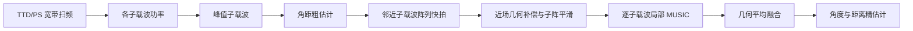

# Beam Squint Assisted Joint Angle-Distance Localization for Near-Field Communications

- IEEE 版本作者：Aibiao Zhang、Weizheng Zhang、Chiya Zhang、Tingting Zhang
- 期刊：IEEE Transactions on Vehicular Technology（录用作者版）
- DOI：10.1109/TVT.2026.3706538
- arXiv：2509.14850v2（2025-09-19 更新）
- 学科分类：cs.IT
- IEEE PDF：`G:\研究生\paper\Beam_Squint_Assisted_Joint_Angle-Distance_Localization_for_Near-Field_Communications.pdf`
- 本地论文与 TeX：当前目录下 PDF、`source/` 和 `metadata.json`
- MATLAB 复现：`matlab/`

> 当前版本：v1.0 初稿。全文 15 页已阅读；公式以 IEEE 录用版本为主，并用 arXiv TeX 源核对。arXiv v2 比 IEEE 版本早，尚未包含后者新增的近场几何补偿空间平滑等内容。

## 一句话总结

论文提出“可控波束偏斜粗定位 + 局部近场 MUSIC 精定位”的两阶段联合角距估计：用 TTD/PS 让不同子载波对应不同空间焦点，以功率峰值获得粗估计，再对邻近子载波执行几何补偿、子阵平滑、MUSIC 搜索和几何平均融合。第二阶段的角度超分辨能力可以复现，但按照论文公式进行端到端物理仿真时，粗定位轨迹不能覆盖声明的二维区域，距离精度和 CRLB 也无法复现论文给出的毫米级结果。

## 论文要解决什么问题

XL-MIMO、毫米波/太赫兹和大带宽使用户进入辐射近场。此时波前具有球面曲率，用户位置同时影响阵列响应中的线性相位（角度）和二次相位（距离）。传统相移器又会使不同频率的波束焦点发生偏斜。

已有 CBS-Low 类方法先估角度再估距离。论文式 (21) 给出误差传播近似

\[
\Delta r \approx -2r\tan(\theta)\Delta\theta,
\]

说明角度误差会随距离和偏转角放大到距离估计。论文希望在一次宽带扫描内联合得到角度和距离，再用 MUSIC 精化。

## 核心思路

### 1. 近场阵列模型

对 ULA 中心化阵元坐标 \(x_n=nd\)，Fresnel 二阶距离为

\[
r_n \approx r-x_n\sin\theta+\frac{x_n^2\cos^2\theta}{2r}.
\]

阵列导向矢量第 \(n\) 项为 \(\exp(-j2\pi f_m r_n/c)\)。线性项主要携带角度，二次项携带距离。

### 2. 可控波束偏斜与粗定位

式 (19)-(20) 利用最低频率端点 \((\theta_s,r_s)\) 和最高频率端点 \((\theta_e,r_e)\)，为每个子载波生成焦点 \((\tilde\theta_m,\tilde r_m)\)。接收功率峰值

\[
m^\star=\arg\max_m |z_m|^2
\]

随后映射为粗估计 \((\hat\theta^{(0)},\hat r^{(0)})=(\tilde\theta_{m^\star},\tilde r_{m^\star})\)。

### 3. 几何补偿空间平滑

单快拍协方差 \(\mathbf y_m\mathbf y_m^H\) 秩为 1。论文将 256 元阵列切成 129 个重叠的 128 元子阵，并以中心子阵为参考。每个子阵先根据粗估计乘以对角相位矩阵 \(\mathbf D_{p,m}\)，再平均外积得到 \(\tilde{\mathbf R}_m\)。若粗估计准确，所有子阵信号会对齐到参考子阵，同时白噪声协方差保持不变。

### 4. 局部 MUSIC 与多载波融合

对 \(\tilde{\mathbf R}_m\) 特征分解后，以最小的 \(M_s-1\) 个特征值对应向量构成噪声子空间。逐子载波谱为

\[
P_{\mathrm{MUSIC},m}(\theta,r)=
\frac{1}{\mathbf a_m^H\mathbf U_{n,m}\mathbf U_{n,m}^H\mathbf a_m}.
\]

论文只在粗估计的 \(\pm1^\circ,\pm1\text{ m}\) 邻域搜索，并对多个邻近子载波谱做几何平均，最终取二维峰值。

## 实验设置

论文表 II 明确给出的默认参数：

| 参数 | 数值 |
|---|---:|
| 载频 | 60 GHz |
| 带宽 | 3 GHz |
| 子载波数 | 2048 |
| ULA 阵元数 | 256 |
| 阵元间距 | \(\lambda/2\) |
| 子阵大小 | 128 |
| 重叠子阵数 | 129 |
| 声明的感知区域 | \(-60^\circ\) 至 \(60^\circ\)，15 m 至 50 m |

论文未给出：邻近子载波数量、二维网格间隔、蒙特卡洛次数、单用户默认坐标、深度学习训练细节与权重、各基线完整配置。复现默认采用 5 个子载波、三级多分辨率局部网格、12 次蒙特卡洛，随机种子为 20260901；这些都集中在 `matlab/+jad/defaultConfig.m`。

## MATLAB 复现结果

### 已实现并通过 MATLAB MCP 验证

- 式 (19)-(20) 可控轨迹
- 式 (21) 两阶段误差传播
- Fresnel 近场导向矢量和物理阵列增益
- 功率峰值粗估计
- IEEE 版本新增的近场几何补偿空间平滑
- 多子载波局部 MUSIC 几何平均融合
- 附录 B 原样 CRLB 与未知复幅度投影 CRLB
- MATLAB 单元测试：8 项全部通过
- MATLAB Code Analyzer：核心脚本无警告/错误

### 论文图逐项状态

| 论文图 | 状态 | 结论 |
|---|---|---|
| Fig. 2 | 公式重算 | 趋势和量级与原文吻合。 |
| Fig. 3 | 关键数值重算 | 27/30/33 GHz 的三个标注焦点与原文一致，构图已按论文扇区重做。 |
| Fig. 4 | 图形重建 | 原文未给参考距离；按原图 `0.12 deg -> 1.20 m` 的比例生成。 |
| Fig. 5 | 仅几何重绘 | 原文蓝色轨迹与式 (19)-(20) 不一致，不能标为公式复现。 |
| Fig. 6-8 | 定性重建 | 目标位置和坐标范围一致，但谱正则化、快拍和噪声设置未公开，不能声称逐点一致。 |
| Fig. 9 | 数值转录 | 柱值来自论文，缺少可重算的硬件计时环境和代码。 |
| Fig. 10-13 | Proposed 曲线数值复原 | 已从 IEEE PDF 矢量路径恢复论文所提方法的坐标并用 MATLAB 重绘；暂不包含其他基线。这不是作者蒙特卡洛代码的端到端重跑。 |

因此，本项目当前不是“作者仿真代码已完整重跑”。`matlab/results/paper_figures/` 现包含 Fig. 2-9 的分级结果以及 Fig. 10-13 的 Proposed-only 已发表曲线数值复原。若要把 Fig. 10-13 升级为独立蒙特卡洛复现，仍需作者代码、完整随机实验配置和粗定位条件。

### 关键数值

目标为 \((15^\circ,30\text{ m})\) 时：

| 项目 | 结果 |
|---|---:|
| 无噪声物理粗估计 | \((15.0226^\circ,102.6490\text{ m})\) |
| 给定 \((15.35^\circ,30.40\text{ m})\) 粗先验后的 10 dB MUSIC | \((15.0027^\circ,30.8867\text{ m})\) |
| 10 dB、12 次试验角度 RMSE | 0.001483° |
| 10 dB、12 次试验距离 RMSE | 0.3401 m |
| 论文印刷 CRLB（距离） | \(1.11\times10^{-5}\) m |
| 消除未知复幅度后的距离 CRLB | 0.7033 m |

角度 RMSE 随 SNR 下降并在高 SNR 达到约 \(10^{-3}\) 度，定性趋势与论文一致。距离 RMSE 也随 SNR 下降，但为分米到米级，与论文图 10 的毫米级结果不一致；其量级反而接近未知复幅度投影后的合理 CRLB。

## 无法数值级复现的原因

### 1. 一维频率索引不能覆盖二维矩形

一个子载波索引 \(m\) 经式 (19)-(20) 只映射到一条一维曲线，而不是二维区域。把论文表 II 的端点 \((-60^\circ,15\text{ m})\) 和 \((60^\circ,50\text{ m})\) 代入后，轨迹中段最高约 104 m，明显离开 15-50 m 区间。对论文图 5 使用的目标 \((15^\circ,30\text{ m})\)，严格阵列增益仿真虽然能得到尖锐功率峰，但该峰映射到约 102.65 m，无法满足第二阶段要求的 \(\pm1\text{ m}\) 粗定位窗口。

这不是网格分辨率或 MATLAB 实现误差，而是映射维数和式 (20) 的直接结果。若没有额外扫描维度、多条轨迹、多个 RF 观测或其他先验，单个峰值子载波不能唯一编码任意二维位置。

### 2. 附录 CRLB 未正确处理未知复幅度

附录 B 明确把复反射系数 \(s_l\) 视为未知确定性参数，但式 (59) 直接使用导向矢量导数，没有投影掉未知幅度张成的子空间。这样会把所有阵元共有、可被复幅度吸收的全局距离相位当成有效信息，从而产生过于乐观的距离 CRLB。

MUSIC 使用谱分母的绝对值，对全局相位不敏感，实际只能依赖较弱的二次相位曲率估距。因此论文印刷 CRLB 不适合与该 MUSIC 实现直接比较。代码同时保留 `paperCrlb` 和修正后的 `projectedCrlb`，便于复核。

### 3. 基线和实验参数不完整

Deep Learning [21]、DFT codebook [16] 和 CBS-Low [20] 依赖其他论文的实现、训练数据或扫描配置。本文没有公开对应代码，也没有给出足以唯一重建图 10-13 的参数。本复现没有用人工描点或手工数组伪造这些曲线。

## 贡献、亮点与边界

论文最有价值的部分是把宽带波束偏斜从损伤转化为粗搜索机制，并提出以中心子阵为参考的近场相位对齐，修正普通空间平滑在球面波条件下的子阵几何失配。局部搜索也显著降低了全局二维 MUSIC 的计算量。

适用边界包括：LoS 单径或可分离路径；顺序单 RF 探测可重建阵列快拍；粗估计必须落入很小的局部窗口；Fresnel 二阶近似在超大孔径、极短距离时会失效；多用户需要正交导频或时频码调度先分离。论文虽然声称多用户抗耦合，但系统模型又假设用户可由正交资源逐用户分离，二者应区分理解。

## 对后续研究的建议

1. 用两次独立 TTD 轨迹或二维编码观测，使粗阶段真正具有两个独立测量维度。
2. 用候选位置相关的几何补偿，或在每次 MUSIC 更新后重新对齐子阵，减少粗估计误差带来的偏置。
3. 推导包含未知复幅度、噪声方差及多快拍的完整 Schur 补 CRLB。
4. 公开随机种子、目标坐标、网格、载波集合、试验次数、基线代码和训练权重。
5. 在精确球面距离模型下验证极近场，并报告 Fresnel 近似误差随阵元数和距离的变化。

## 术语表

| 术语 | 含义 |
|---|---|
| XL-MIMO | 超大规模阵列，孔径大到近场区域显著扩展 |
| Beam squint | 波束焦点随频率偏移的现象 |
| TTD | 真时延器，产生与频率成比例的相位 |
| PS | 相移器，提供近似频率无关的相位 |
| JAD | Joint Angle-Distance，角度-距离联合估计 |
| Spatial smoothing | 用重叠子阵构造可分解的协方差估计 |
| MUSIC | 利用导向矢量与噪声子空间正交性的超分辨谱估计 |
| CRLB | 无偏估计均方误差的理论下界 |

## 交付文件

- `matlab/run_reproduction.m`：一键复现实验
- `matlab/+jad/`：轨迹、阵列、粗估计、MUSIC 和 CRLB 函数
- `matlab/tests/testJadCore.m`：MATLAB 单元测试
- `matlab/results/paper_figures/`：Fig. 2-9 的分级重算/重建结果
- `matlab/results/diagnostics/`：与论文 Fig. 10-13 不匹配的独立诊断结果，不属于复现交付
- `matlab/results/reproduction_results.mat`：完整数值结果
- `matlab/results/reproduction_summary.csv`：RMSE/CRLB 汇总
- `matlab/README.md`：运行方法与边界说明

## 复查记录

- 2026-08-31 16:38：中国标准时间，初始化论文目录、PDF、TeX 源和报告骨架。
- 2026-08-31：完成 IEEE 15 页全文阅读、arXiv TeX 核对、MATLAB 核心实现、MCP 静态检查与测试、实际仿真和图像 QA；记录无法数值级复现的公式与实验信息问题。
